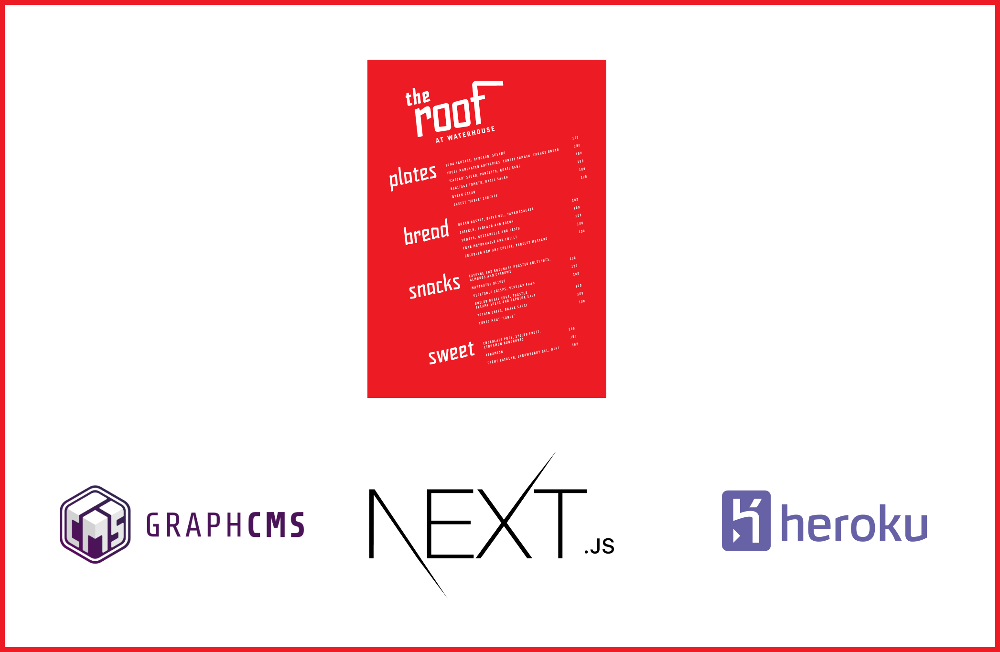

# Editable restaurant menu using Next.js, GraphCMS and Heroku

Source code from the article [Building an editable restaurant menu using Next.js, GraphCMS and Heroku](https://graphql.college/building-an-editable-restaurant-menu-using-nextjs-graphcms-and-heroku).

[](https://graphql.college/building-an-editable-restaurant-menu-using-nextjs-graphcms-and-heroku)

# Getting started

```
yarn
yarn dev
```